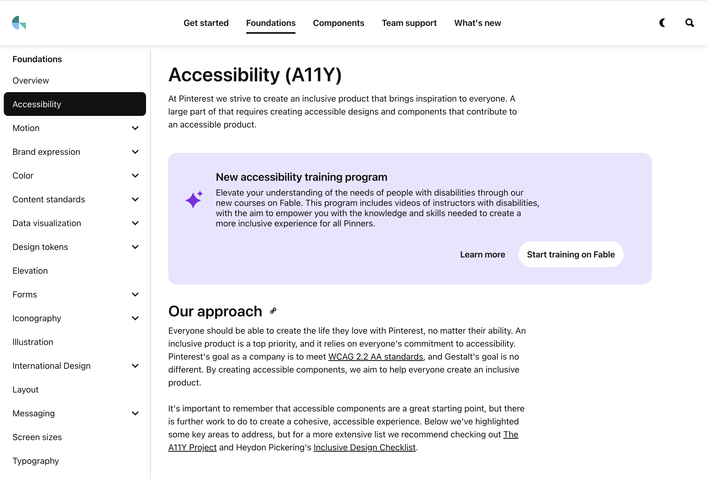
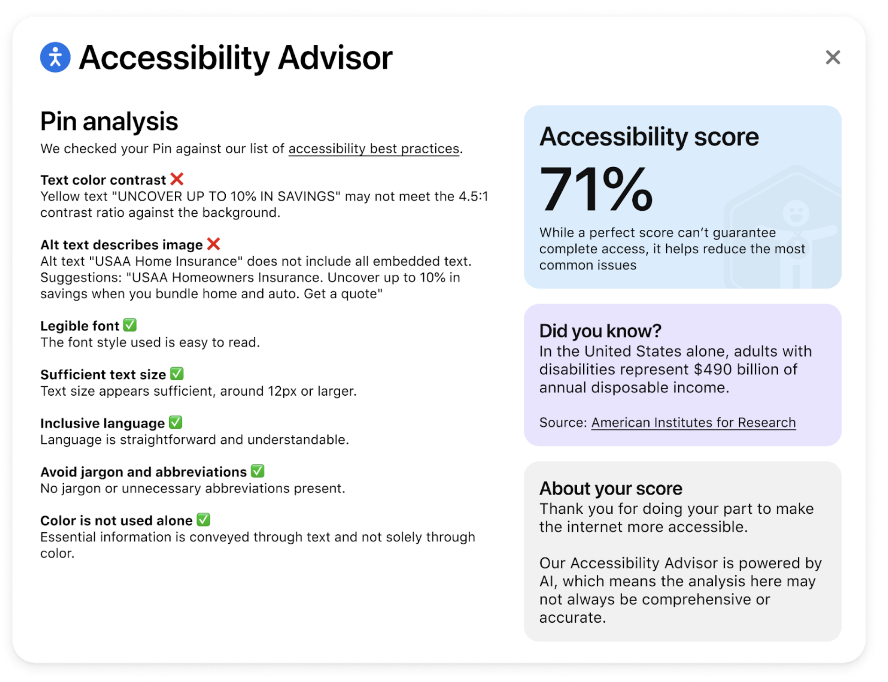
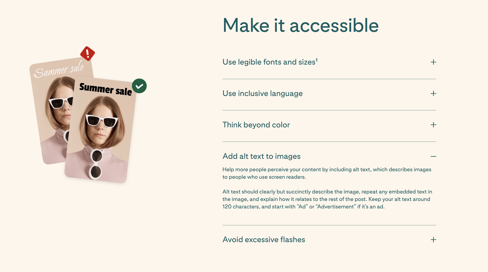
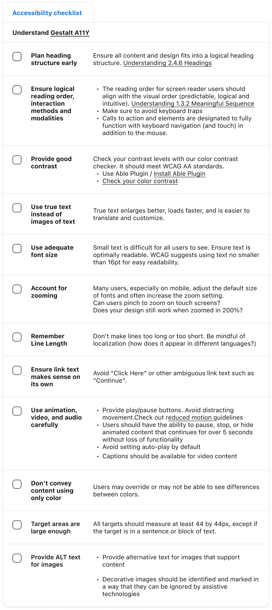

# Accessibility Design @ Pinterest 

Since I started at Pinterest, my goal has been to ensure that Gestalt components from the Pinterest Design System are accessible and considered part of what "done" means. I strongly believe that accessibility should be integrated into everything from the very beginning. As a result, a significant portion of my work has involved enhancing the [Gestalt accessibility page](https://gestalt.pinterest.systems/foundations/accessibility), offering accessibility guidelines for the components, providing consultancy through Office Hours, Slack, and Crit meetings, and supporting designers and engineers as needed from a system designer perspective.

 

<small>Accessibility Guidelines on Gestalt.</small>

 

💙 <ins>Kudos from a teammate:</ins>
 
> "I want to give a Shout Out to Cintia for all the work she does for both the Gestalt team and Pinterest at large. From the start of Cintia's time at Pinterest, I've quickly learned I can depend on her when it comes to expert guidance and wisdom related to design systems and accessibility. Now that I'm a full-time employee, I can finally give my thanks here!
>
> Thanks for all your hard work Cintia, especially when it comes to your recent work bringing brand guidance into product. Looking forward to what's to come next!"

In the past year, I shifted from my role as a systems designer to lead accessibility efforts within Foundations, the goal was to help shape an accessibility program vision, and serve as a subject matter expert to support product teams within and beyond Design Foundations. 

My role as an Accessibility Lead at Pinterest was based on the four pillars below:

## 1. Set the ground for accessibility

- Developed a Business Case document for Accessibility to support the team to get leadership buy-in for accessibility efforts. 
- Worked with my manager and other stakeholders to define a roadmap for accessibility. 
- Worked with another designer to build our Digital Internal Policy for Accessibility to support cross functional accessibility initiatives. 
- Interviewed and hired a designer contractor, and acted as the Assigned Manager, leading the contract work on auditing 20 components in the Gestalt Design System to achieve compliance, identifying and supporting the remediation of 15 accessibility issues, plus directing the work on redesigning our former accessibility annotations kit. 
- Contributed to create a TPM accessibility-related job kit, and joined the panel interviews to hire our new role to support accessibility. Yay! 

## 2. Usability test with people with disabilities

- Proposed and onboarded a new vendor, [Fable](https://makeitfable.com/), to support accessibility initiatives such as research and training.
- Partnered with the UX Research and Legal teams to develop a research process and assign DRIs for usability studies.
- Planned over 10 usability studies scopes.
- Conducted and moderated over 25 user interviews and usability studies with people with disabilities via our provider Fable, extracting actionable insights that drove 15+ key product core improvements. 
- Synthesized research findings to inform cross functional projects to improve the Pinterest product (website and app) accessibility. 

## 3. Consultancy and training

- Partnered with [Fable](https://makeitfable.com/) and another designer to create an accessibility training program, including a fundamental overview for designers, and mobile apps development.
- Supported planning for accessibility product audits, as well as acting as the Design Foundations Accessibility SME by reviewing, prioritizing and routing issues, both for web and mobile. 

 

💙 <ins>Kudos from a teammate:</ins>

> "Cintia, thank you for all your efforts spinning up the Accessibility Design program. You’re leading the charge running studies w/ Fable, supporting the Product Belonging vision with explorations, launching Makeathon work for accessibility guidance for advertisers, and teeing up a business proposal/story to spotlight all this hard work. I know you’ll continue to be a strong teammate and design partner to bring accessibility to the forefront at Pinterest. Keep up the resilience!"

 

💙 <ins>Kudos from my manager:</ins>

> "Hats off to Cintia, who laid the groundwork for our new Accessibility Design program. She sourced and onboarded a new vendor who help us run accessibility and usability tests with disabled users so we can make the Pinterest product truly more and more a place for **everyone**. Thank you Cintia for working through the transition, taking a first stab at crafting and prioritizing projects on the H2 roadmap, and also hiring a dedicated contractor to support! So very excited to partner with you and help you flourish."

## 4. Advocacy 😀

- Proposed and led a Makeathon (Pinterest Hackathon) Project called Accessibility Advisor. The goal was to use AI to audit ads for accessibility compliance with WCAG 2.2. The project contributed to [business.pinterest.com](http://business.pinterest.com) delivering [5 key accessible creative best practices](https://business.pinterest.com/creative-best-practices/#:~:text=timely%20content%20regularly-,Make%20it%20accessible,-Use%20legible%20fonts) for advertisers.  
- Presented about screen readers and accessibility at Pinterest during the ADA 2024 PinAble (Pinterest Employee Resource Group) event.
- Planned and hosted one of PinAble's 2024 ADA events by moderating an interview with the [Asana](https://asana.com/) Accessibility Team. 
- Designed an accessibility checklist component (Figma) to support designers accounting for accessible experiences. 

 

<small>Accessibility Advisor in action (mockup).</small>

 

<small>Accessibility guidelines for accessible ads. Read all by checking [Pinterest Creative Best Practices](https://business.pinterest.com/creative-best-practices).</small>

 

<small>Accessibility checklist for designers. Check out the [written version here](https://gestalt.pinterest.systems/foundations/accessibility#Design-considerations).</small>

 

Please note that some of the work I mentioned is confidential, so I won’t share information here to respect my company's privacy. If you are curious to learn more about my accessibility expertise or want to chat, feel free to [drop me a line](/contact)! 

Learn more about my work at Pinterest, by checking [Gestalt](/work/project-gestalt/).