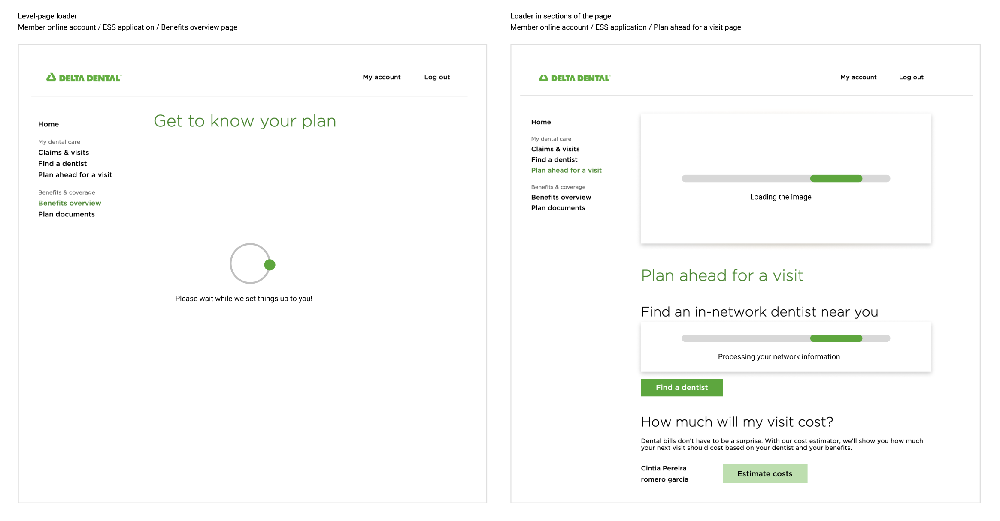
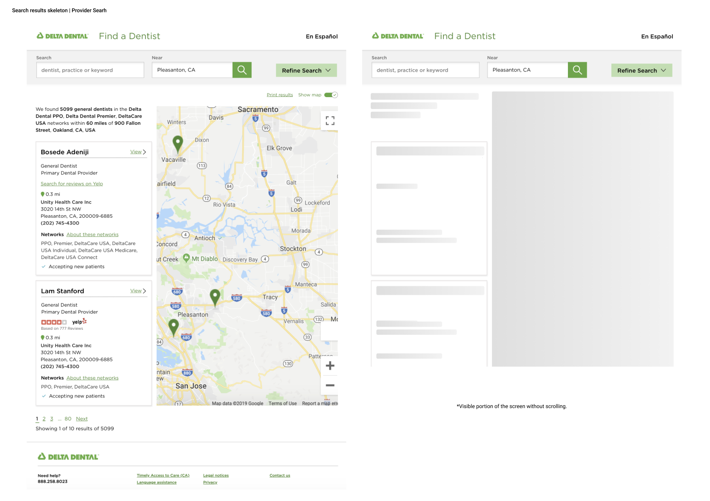

# Emerald @ Delta Dental

I was the UX Lead at Emerald, the Delta Dental design system. During my time there, I supported the launch of the Delta Dental design system, created and documented 24+ components and guidelines, while coaching other designers on design best practices and scaling the library to be adopted at an enterprise level. 

I also organized and spoke in a few workshops and events, educating the Product, Design, and Engineering communities on adopting accessibility as an essential part of the design process.

Besides being a designer lead, I also acted as the site Lead at DLANTE, Delta Dental's ERG for Latinx & Hispanic employees, I was member of the accessibility committee, and co-founder and author at [UXBridge](https://medium.com/ux-bridge), a Medium blog to share design learnings and experiences.

**My team**

   - Design System Manager
   - UX Lead: 1 (me) 
   - Product Designer: 1 
   - Visual Designer: 1
   - Engineers: 2
   - QA: 1 
   - Product Manager: 1
   - Dedicated UX Researcher: 1 

## Emerald components and documentation  

Below is the list regarding the documentation and components I created at Emerald.
At Delta Dental we used Sketch and Storybook for documentation. The components were built using React. 

**Design guidelines**
   - Color palette
   - Form patterns
   - Grids
   - Typography 
   - File hygiene 

**Communication components**
   - Accordions
   - Alerts
   - Badge
   - Data table
   - Help link
   - Icons
   - Info badge
   - Modals
   - Mini-tip
   - Pagination 
   - Status

**Collecting information**
   - Dropdowns
   - Checkbox
   - Radio-buttons
   - Text fields

**Action**
   - Autosuggest
   - Breadcrumbs
   - Buttons
   - IconButton
   - Links
   - Pagination
   - Search input
   - Simple menu
   - Toggle switch

 

<small>Loader example</small>

 

<small>Skeleton example</small>

 

You can find the documentation and context regarding the images above by checking the following links: 
  - <a href="../../project-emerald-loader.pdf" target="_blank" rel="noopener" >Loader</a>
  - <a href="../../project-emerald-skeleton.pdf" target="_blank" rel="noopener" >Skeleton</a>

**Disclaimer:** The design system is an internal resource, so unfortunately I can’t share much of it here. Feel free to reach out if you want to learn more about my work on Emerald.

## Emerald component process 

### The approach 

**Design**
1. Compare 
1. Concept
   - Design concepts
   - Write design documentation
   - Define behaviors
1. Evaluate
   - Delta Dental standards
   - Accessibility 
   - Usability
   - Reusability 
1. Review and select 
   - Component bash
   - Engineering evaluation
   - Critique
   - Review request

**Engineer**
1. Investigate
   - Open source component
   - Implementation accessibility 
1. Build 
   - Open source code
   - Fix accessibility issues (if applicable)
   - Adjust semantic tokens 
   - Write developer documentation
1. Test 
   - Run unit tests
   - Define test cases
   - Specifications
   - Accessibility test
   - Pull request 

 

 

### Component lifecycle

1. Component created
1. Adoption
   - Accessibility issue
   - Usability challenge
   - New scenario (when applicable)
   - Implementation issue
   - Branding update
1. Fix
   - or deprecate when applicable
1. Rollout 

 

 

### Ensuring accessibility 

One of the core values of Emerald was accessibility. We believed it was everyone’s job in the team, no matter their role. We worked closely with product managers, designers, engineers, accessibility specialists, QAs and a third party auditing agency to bring awareness, education and remediation regarding accessibility.

 

 

### Component definition of done  
For all components, we needed to ensure:

   - Well structured design file 
   - Usage guidelines were defined
   - Behaviors were documented 
   - Have no significant evidence of usability issues
   - Not redundant
   - Not application-specific 
   - Accessible 
   - Have passed linting
   - Have completed unit tests written and passed
   - Include all functionality as documented 
   - Design and documentation reviewed and approved by at least 2 designers 
   - Buildable with low effort 
   - React component reviewed by a designer and at least 2 developers
   - Responsive (mobile-friendly) 
   - Conformant with Brand guidelines 

 

<small>Design system workshop around “definition of done”</small>

 

## Learnings 

Working at Delta Dental was an incredible experience for me! I had an incredible group of teammates and learned a lot, particularly about accessibility. I was able to work with a diverse team, and grow as a lead by launching the design system from scratch and mentoring many designers. 

If I could go back and change anything, I would enhance the documentation process, making it easier for designers to update content. It would save us time and make the work more efficient. 

 

💙 <ins>Kudos from my manager:</ins>

> "Cintia, I’m sure you already know, but you’ve had an incredible impact on the team, culture and work. Emerald absolutely wouldn't be what it is without your leadership, constant focus on quality, accessibility, and active support for so many people on the team. Your help in advocating for a more inclusive product and workspace inspire me and have helped us make Emerald into a place that can drive those changes."

 