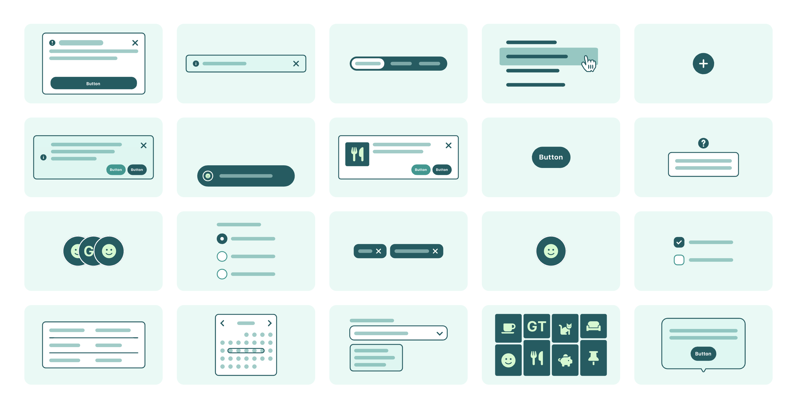
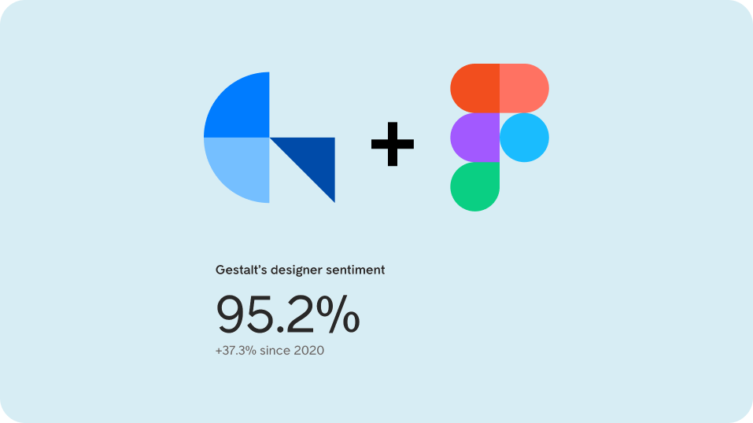
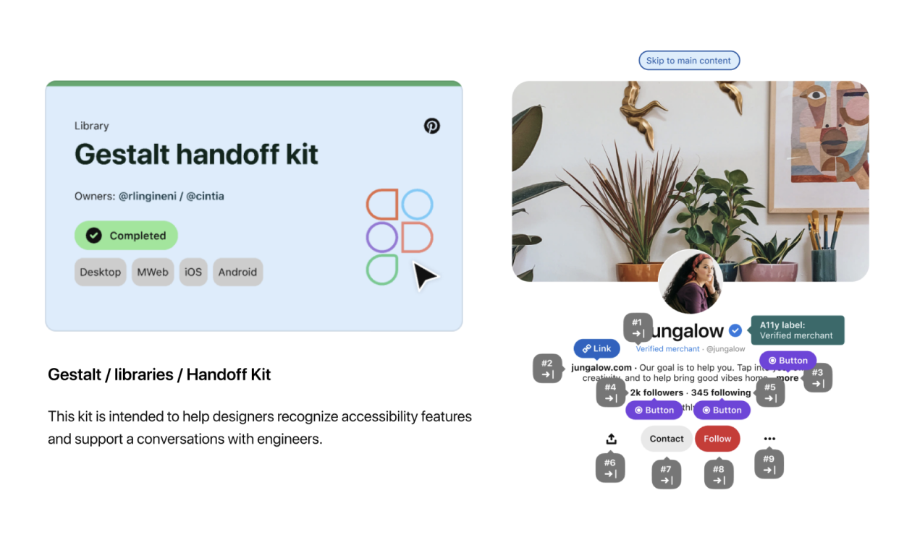
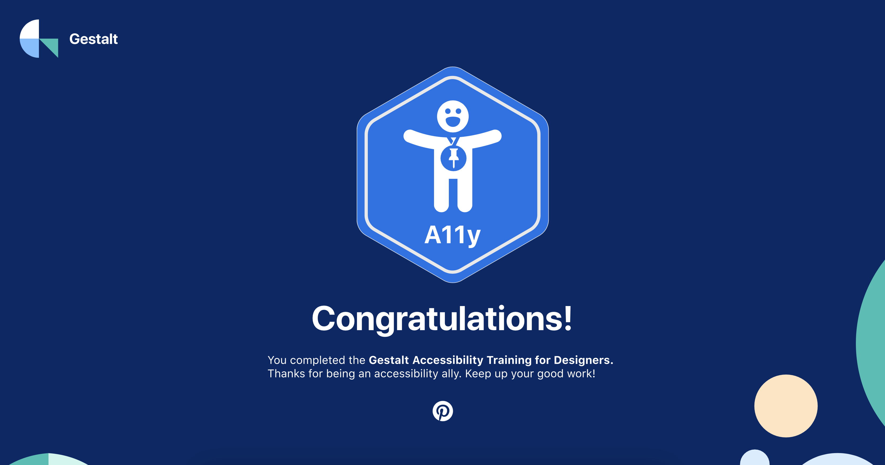
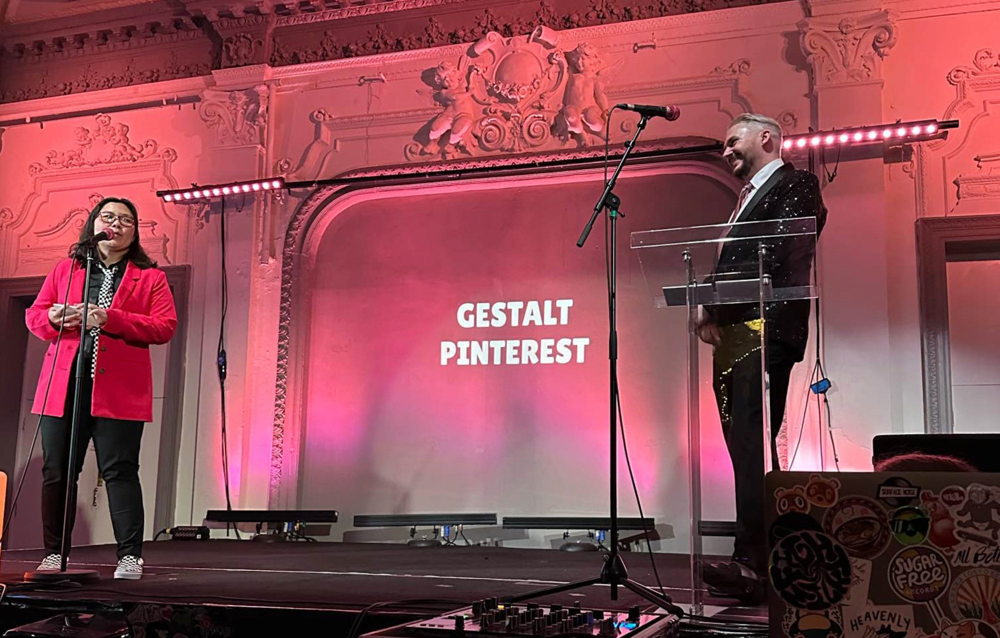
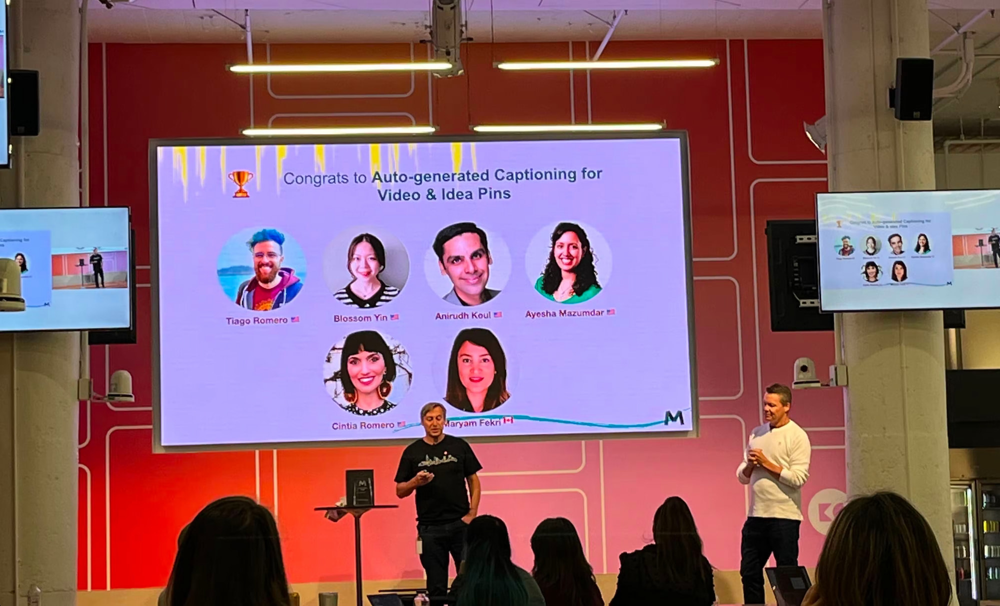
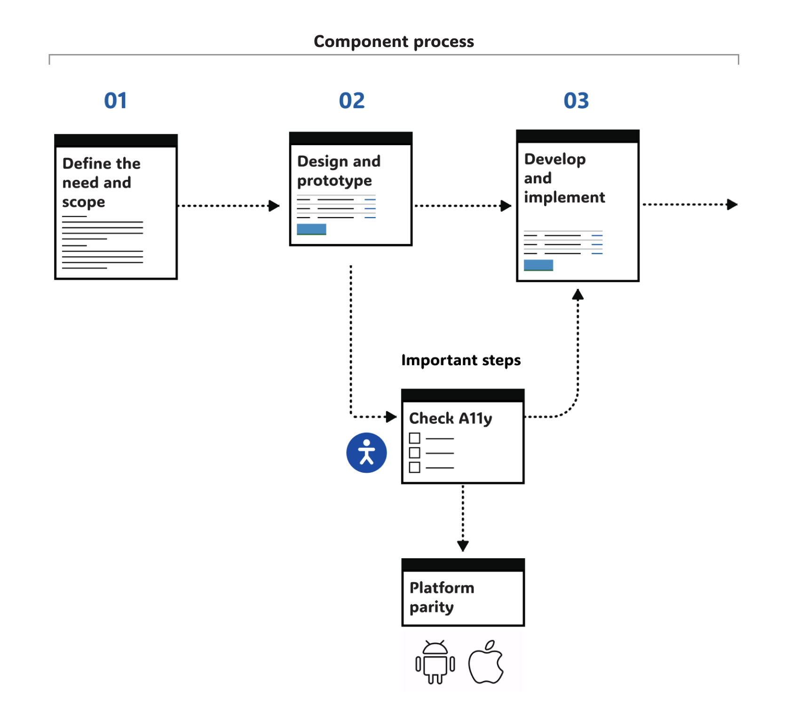
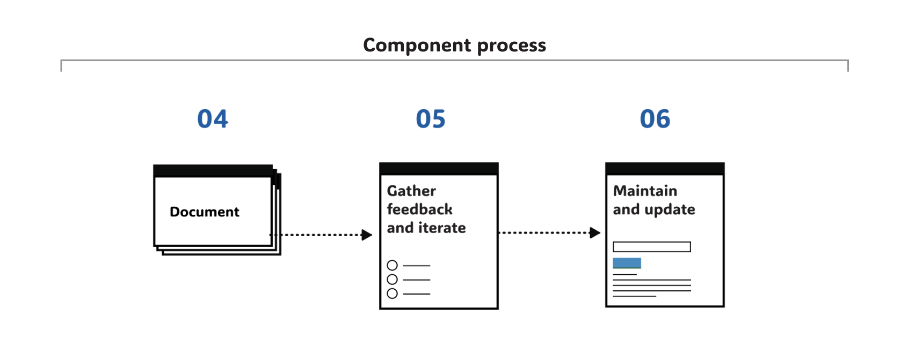

# Gestalt @ Pinterest

I joined [Gestalt](https://gestalt.pinterest.systems/) (Pinterest's Design System) in 2021 to be the first Product Designer fully dedicated to the design systems team. Before moving to an accessibility dedicated role (my current role), I spent my past years crafting components, writing guidelines to support designers and engineers, developing system education (training, resources and workshops), and advocating for accessibility and inclusive design. 

 

<small>Gestalt components</small>

## Some of my (Gestalt) wins 

- My work around community advocacy regarding components libraries led to a 37.3% increase in designer sentiment of Gestalt compared to previous years, bringing it up to 95.2%.

 

- I published the first Accessibility Annotations Kit to support design/engineering handoff.

 

- I built the first ever accessibility training for designers at Pinterest and made the training part of the EPD onboarding. Every new hire in our org now gets to learn about digital accessibility! 

<small>"You completed the Gestalt Accessibility Training for Designers. Thanks for being an accessibility ally. Keep up your good work."</small>

 

- I idealized and launched the [Design System Day](https://medium.com/pinterest-studio/why-we-host-an-internal-design-systems-conference-3bb6017c6ca2), an internal conference that focuses on design system, accessibility and community.

<small>*Photo courtesy P.J. Onori.</small>

Some of the attendees feedback:

> "Only Pinterest can make an online event this much fun! This Design System conference was an example of inspiration and new trends. I met a lot of people and learnt a lot at the event; it felt like I was there in person. Please continue to make it happen every year!"
> -- UX/UI Designer @ Pinterest

> "The space was encouraging and I felt very welcomed. It's really moving to be surrounded by so many people who genuinely care about accessibility and inclusion. I love this community!"
> -- Software engineer @ external company

> "Events like Design System Day are very important as the design system community evolves. It was great to connect with like-minded folks and hear their perspectives on inclusive design, accessibility, and design at scale. Sharing our struggles and victories makes us stronger!"
> — Design System Day speaker

 

- Awarded Design System! Gestalt won in three categories: **Best collaboration**, **Best article** ([How Gestalt measures adoption](https://www.figma.com/blog/how-pinterests-design-systems-team-measures-adoption/) by Ravi Lingineni), and **People’s Choice**. It was great being honored with other amazing design systems teams in the industry, and the three awards track with our current internal initiatives: more adoption, more contributions and even more collaboration. I was also a nominee and finalist in the **"Best talk"** category ([watch my talk](https://www.youtube.com/watch?v=SN4G7MvGGvQ)). Awards were given by the [Zeroheight Design Systems Awards](https://zeroheight.com/events/design-system-awards/).

 

- My project "Closed Captioning for Videos and Idea Pins" won the 2022 Makeathon (Pinterest Hackathon) getting the prize for the Creating Belonging category.

<small>I won, yay 🎉*</small>

## My design process: creating a component 

Over the past three years, I have worked on multiple components and projects, but one of my favorites was the [Link component](https://gestalt.pinterest.systems/v1/web/link). Although it appears simple, the link element often presents various challenges related to usability and accessibility.

Below I describe my design process using the "Link" redesign project as an example, which is a similar process for most of the components I build. 

 

<small>My 6-step component design process, steps 1 to 3.</small>

 

### 1. Define the need and scope
   - **Identify the problem:** What user need or pain point I’m trying to solve with the link redesign?
   - **Define scope:**
      - What are the core functionalities of the Link component?
      - What are its limitations?
      - What are the expected variations or states?
   - **Consider use cases:** How will the Link component be used within the product? Considering the Pinner and the Business side. What are the most common scenarios?

### 2. Design and prototype
   - **Create wireframes:** Draft a mockup of how the Link component will be used within the product.
   - **Design interactions:** Define how the Link component will behave and respond to Pinner input (e.g., clicks, hovers, keyboard interactions).
   - **Consider accessibility:** Ensure the Link is accessible to Pinners with disabilities (e.g., screen reader compatibility, keyboard navigation, sufficient color contrast).
   - **Create the Figma component and its variants:** Design the component and use the proper tokens. Publish the component on Figma. 
   - **Platform parity:** Ensure the component works on all devices and platforms. Design mobile version if applicable. 
   - **Prototype:** When applicable, create an interactive prototype to test the component's functionality and usability.

### 3. Develop and implement
   - **Develop the component:** Work with the engineer to ensure the link component follows the established coding standards and best practices.
   - **Unit testing:** Have the engineering team performing unit tests to ensure the link component functions as expected.
   - **Integration testing:** Have the engineering team integrate the link component into the larger product and test its functionality in the context of the overall user experience.

 

<small>My 6-step component design process, steps 4 to 6.</small>

    

### 4. Document
   - Write clear and concise documentation for the link component, including usage guidelines, best practices, and accessibility considerations. If the component has a different version for mobile, create the respective docs. 

### 5. Gather feedback and iterate
   - **Gather feedback from stakeholders:** Collect feedback from designers, developers, and product managers.
   - **User testing:** When possible (I highly recommend it), conduct usability testing with Pinners to gather feedback on the component's effectiveness and identify areas for improvement.
   - **Iterate and refine:** Based on feedback and testing results, iterate on the component design and implementation to improve its usability and accessibility.

### 6. Maintain and update
   - Regularly review and update the link component as needed to address bugs, improve performance, and incorporate new features.

 

See the [Link documentation](https://gestalt.pinterest.systems/v1/web/link) on its current state: 

<iframe src="https://gestalt.pinterest.systems/v1/web/link" style="
  width: 100%;
  height: calc(70vh + 76px);
  border: 0;
  margin-top: -76px;
"></iframe>

## More of my work

Besides components, I also worked on the following foundation guidelines and patterns: [Accessibility guidelines](https://gestalt.pinterest.systems/foundations/accessibility), [Brand expression](https://gestalt.pinterest.systems/foundations/brand_expression/guidelines), [Color palette](https://gestalt.pinterest.systems/foundations/color/palette), [Color usage](https://gestalt.pinterest.systems/foundations/color/usage), [Elevation](https://gestalt.pinterest.systems/foundations/elevation), and [Team support](https://gestalt.pinterest.systems/team_support/overview).  

 

💙 <ins>Kudos from an engineer teammate:</ins>

> *"Cintia did an awesome job on her Gestalt Links redesign work and she has been an awesome partner to work with!"*

 

You can also learn more about my journey at Pinterest by reading the article: [People behind the product: Cintia Romero](https://www.pinterestcareers.com/life-at-pinterest-blog/inclusion-diversity/people-behind-the-product-cintia-romero-pinterest-product-designer/). 😀
