# Monument Impact

[Monument Impact](https://monumentimpact.org/) is a non-profit website project I supported to ensure that immigrants, refugees and low-income residents in Concord and surrounding communities have the voice, tools and relationships necessary to earn an equitable share of the social and economic wealth. The goal was to elevate the look and feel of Monument Impact, bringing more donations to the community and focusing on a mobile-friendly interface.

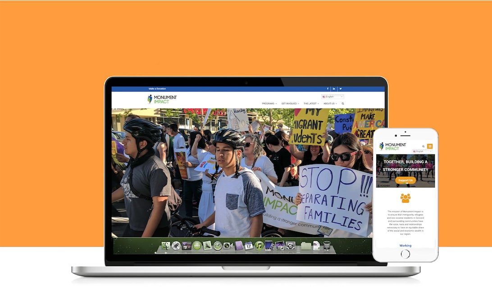

## The problem definition 

A non-profit organization has many challenges. One of the most important tasks is to gain visibility and trust, so the organization can join funds to develop projects benefiting the community. As every non-profit organization, Monument Impact needs more donations. **How to increase the amount of donors through Monument Impact’s website?**

The foundation of this project based on research and in case studies, focusing in User Interface and in a mobile first concept to increase the number of access, attracting more donors to the cause. 

My first priority was to make it possible for the users to find specific information on the website in an easier way, in multiple platforms. 

## The user research

Students, employees, and potential students and donors. 

I did my research through surveys with quantitative and qualitative questions. The surveys had two versions, English and Spanish.  

I also performed interviews and group dynamics with employees to collect and observe expectations about the redesign.

### General results from the surveys

- 92% of the users go to the website to check  news and updates about classes and events.
- 86% of the users access the website every couple weeks. 
- 43% of the users use a smartphone to access Monument Impact website.
- 78% of the accesses come from students. 
- 81% of the users are latinos, and Spanish is their primary language. 

### Pain points

- 62% of the users complained about features not looking good on mobile platforms. 
- 90% of the users thought the website doesn’t properly convey all the great work Monument Impact provides to the community.  
- 83% of the users thought the website is outdated and “old school”.
- 70% of the users complained about broken links.
- 53% of the users needed support to translate contents and classes schedules.

### General results from employees interviews

- 100% want to have a translation feature on the website, so everyone can understand the content.
- 70% agree the website needs to have updated pictures. 
- 90% want a cleaner website.
- 100% want to have a platform which is easier to update.
- 50% showed interest to have events listed on the homepage.

## The design solution

Concepts to solve the problem:

- Create a more appealing modern visual, showing all the great work Monument Impact does, attracting donors. 
- Make the Donate CTA pop up, to capture more supporters. 
- Insert a translation plugin, giving Spanish option for the users. 
- Develop a mobile-friendly interface for multiple platforms.
- Work on the contrast, making the website more accessible. 

## Personas

### Persona 1

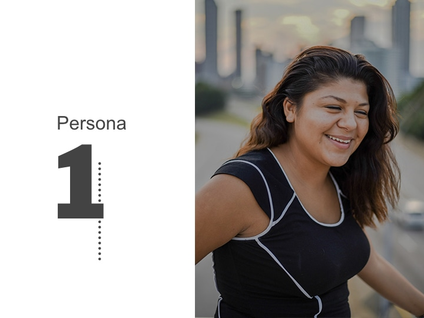

**Background**

- Unemployed 
- Used to work as an officer associate
- Married with 2 children

**Demographics**

- Female
- Age 30-45
- Dual family income: $68,000
- Suburban

**Identifiers**

- Calm personality
- Dreamer
- Fast learner 
- Shy

**Goals**

- Keep family happy
- Support her family with money
- A dream job 

**Challenges**

- Getting everything done with a small amount of time
- Rolling out changes to her professional life 
- Life balance (family X work)

**How can we help?**

- Make it easy to find a job
- Offer programs and benefits
- Connect with students
- Provide support 

**Real quotes from the user research**

- “It’s been difficult getting a job that I really like.”
- “I don’t have too much time to study.”
- “I’ve had to deal with so many painful jobs.”

**Common objections**

- “I’m worried I’ll lose time with my children.“
- “I don’t want to have to work during the weekends.“
- “I’m worried about technology. I’m outdated.“

### Persona 2

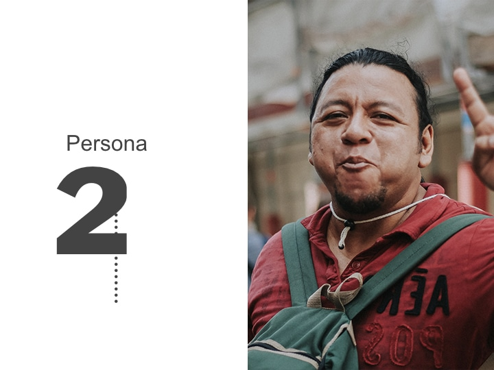

**Background**

- Has 2 jobs 
- Wants to work in management positions
- Unmarried 

**Demographics**

- Male
- Age 28-49
- Dual family income: $79,000
- Suburban

**Identifiers**

- Ambitious personality
- Dreamer
- Easy going
- Great with numbers 

**Goals**

- A nice job 
- Support his family with finances
- Get married
- Work in a full-time job 

**Challenges**

- Find time to study and to invest in his career
- Life balance 
- Language

**How can we help?**

- Make it easy to find a job
- Offer programs and benefits
- Connect with students
- Provide support 

**Real quotes from the user research**

- “It’s been stressful working in two jobs.”
- “I don’t have time to study.”
- “I’ve had to deal with language issues.”

**Common objections**

- “I’m worried about my plans for the future.“
- “I don’t want to have to work in 2 jobs.“
- “I’m worried about study X time.“

## The design process

- **Content**: I reorganized the structure of the pages, added more imagery, icons, and redid the menu flow. My main focus was to provide a website which feels up-to-date, with a fresh look. The idea was to remove old resources and make it more functional and pleasant. 
- **Layout**: I focused on the mobile-first concept and provided a clean layout, with easy-to-find information about the organization and make donations.
- **New feature**: I added a Google Translate bar on the top, so the users can have access to the content in Spanish as well. 
- **Extras**: Besides the Translate bar, I inserted a search bar, a contact form and a Subscribe section on the footer. 

## The user tests

Once the first round of the layout was implemented on the Wordpress template, I did a draft publication on Wordpress, so the Marketing and Product team could go over the pages and do QA tests on the new structure.

- 100% of the testers enjoyed the new features (Google Translate bar, Search bar, Contact Form and Subscribe section).
- 80% of the testers found the website easier to navigate.
- 95% of the testers found the new interface beautiful and clean.
- 50% of the testers got confused with the Events List integrated with the Wordpress Events Calendar. They expected the list to be integrated with Eventbrite. Then, we changed the Events List to pull data from the Eventbrite publications instead of the Wordpress Events Calendar.

*"The website looks great, I really like the cleanliness of it".* - User test

## The low-fidelity wireframes

I prefer starting out with low-fidelity wireframes to think through the structure of the page. I used Adobe XD to iterate during the design process.

### Homepage

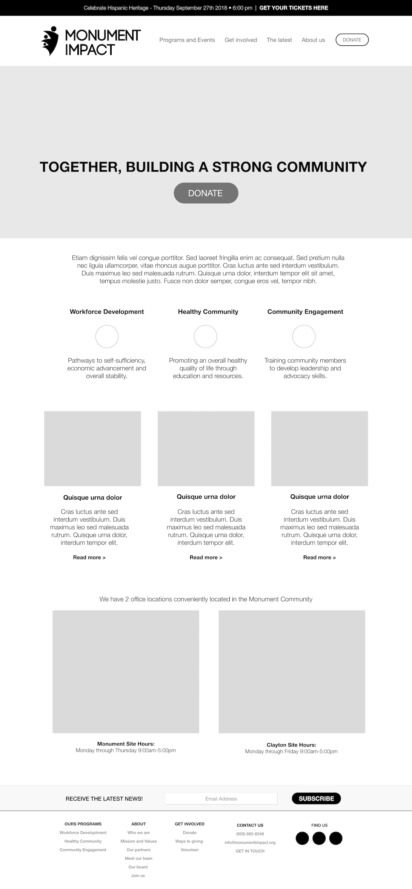

### Programs

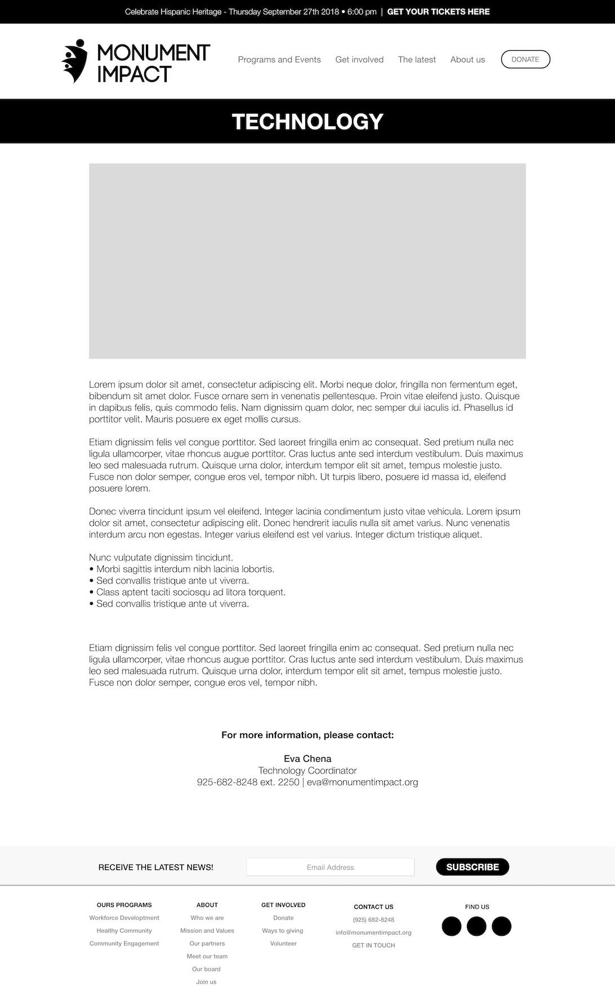

### Contact us

---

## Before and after

Here you can see the evolution of a few pages, as how they were before my work, and how they became after it.

### Homepage (Before)
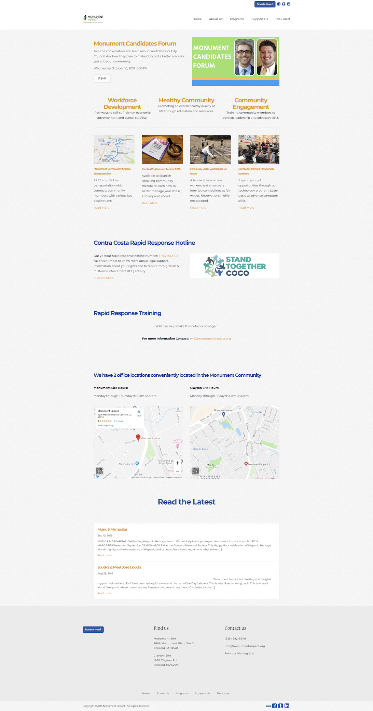

### Homepage (After)
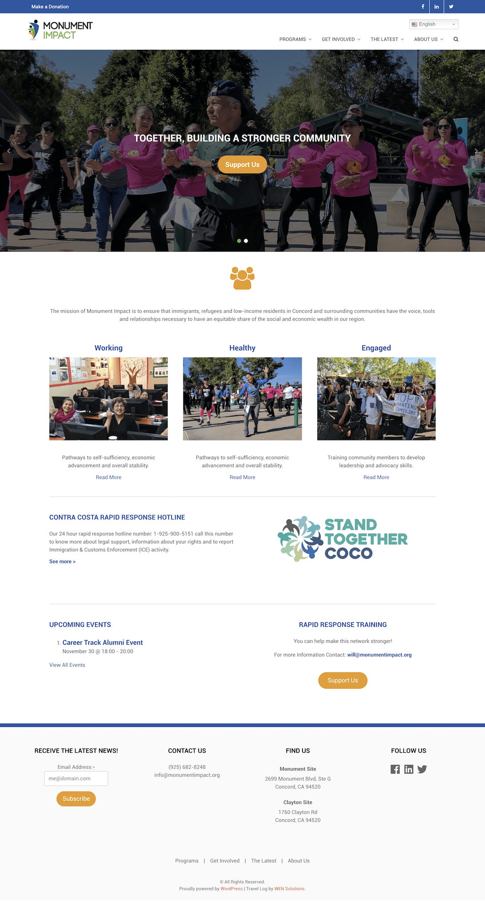

---

### Mission and values (Before)
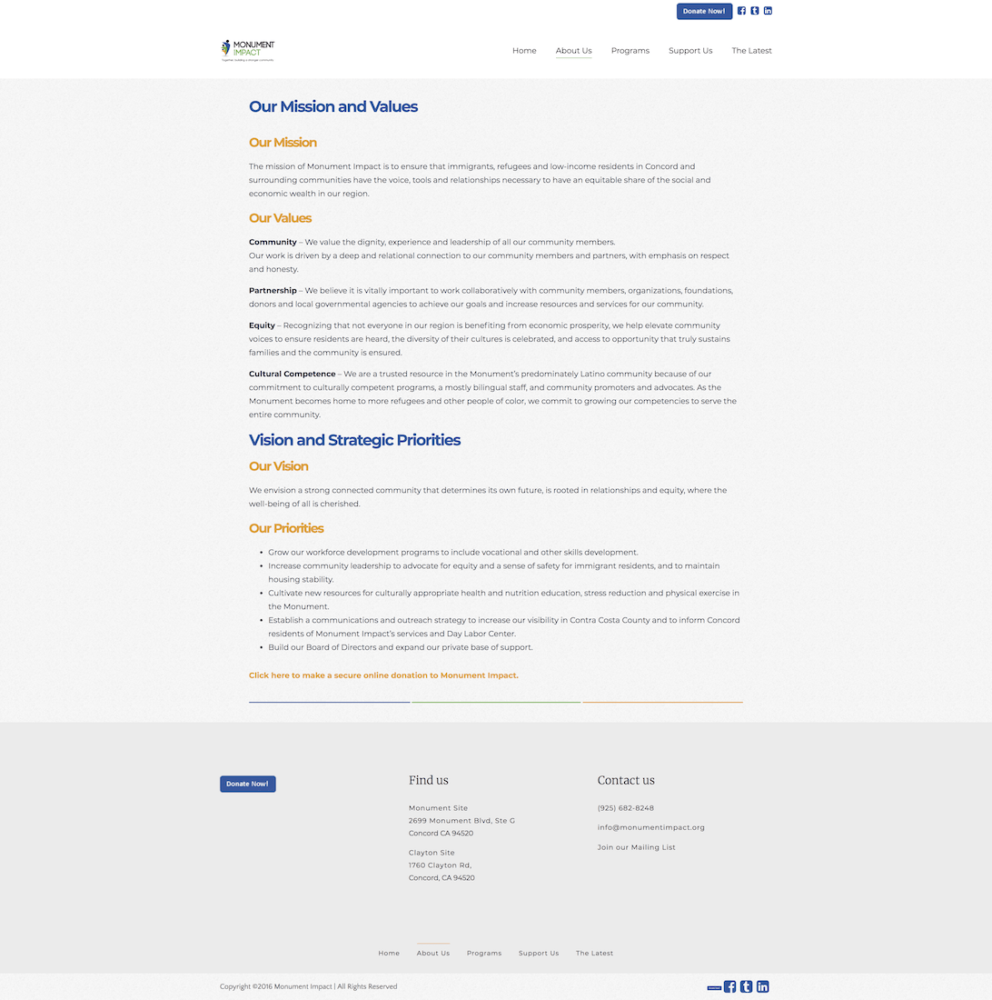

### Mission and values (After)
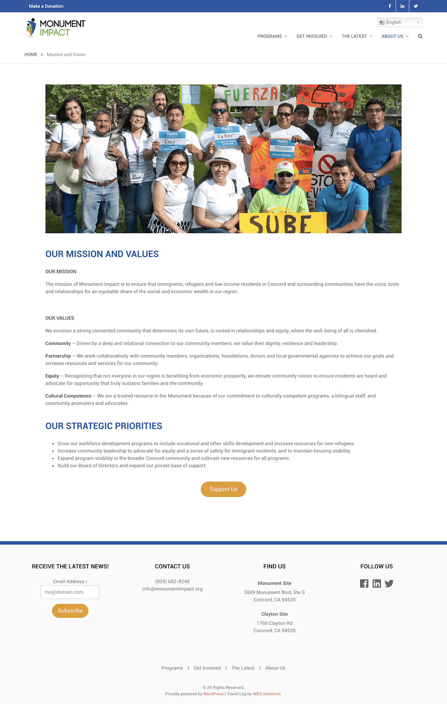

---

### Team (Before)
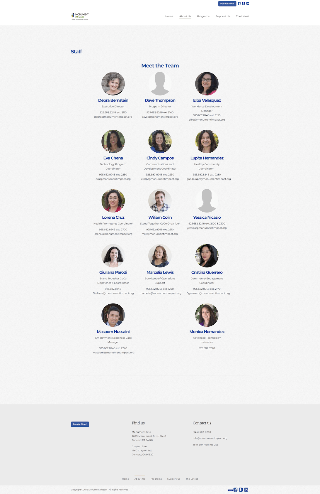

### Team (After)
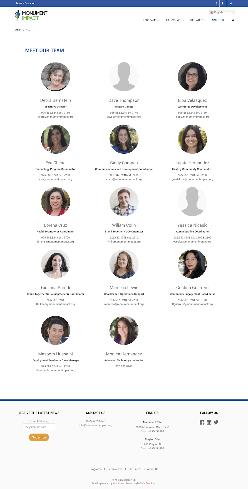

---

### Technology (Before)
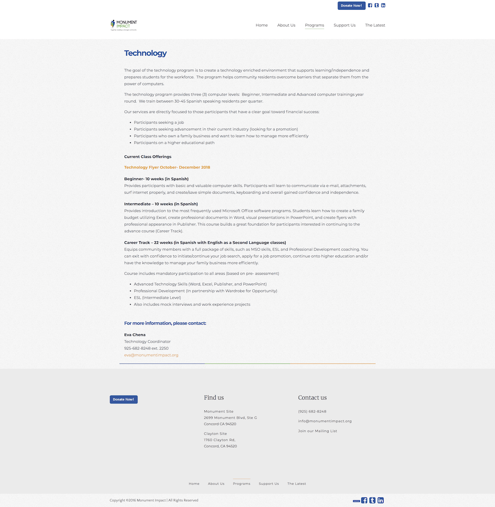

### Technology (After)
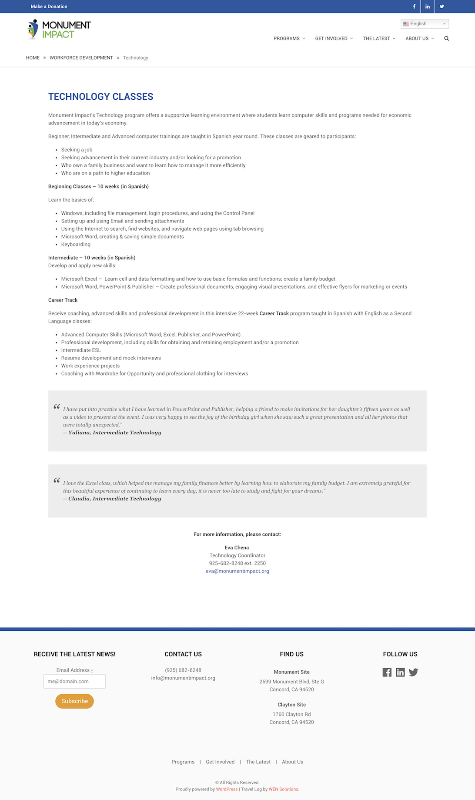

---

### Ways of giving (Before)
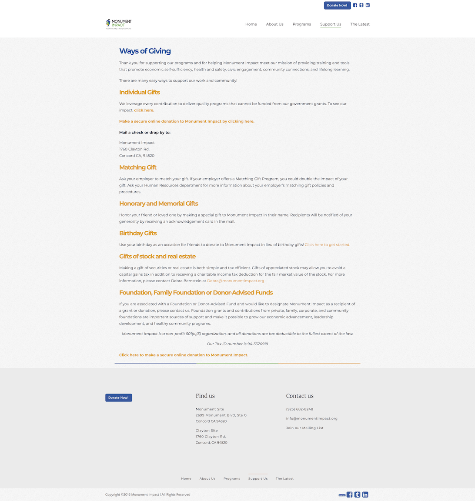

### Ways of giving (After)
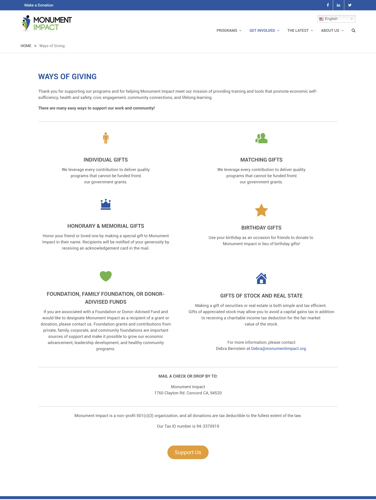

---

## Reflection 

This project was such a great experience for me. I loved diving more into Wordpress templates and features, customizing and creating a whole redesign. 

All the research and interviews helped me to apply usability in my designs, and it felt good to develop a clean and responsive interface, with the confidence that users will be surprised in a good way by it.