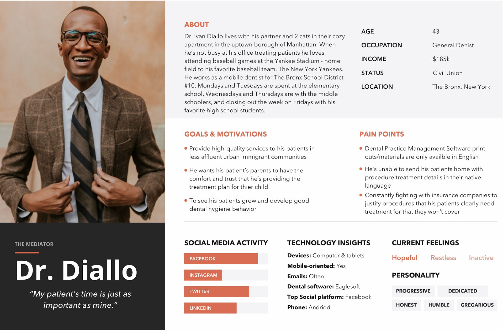
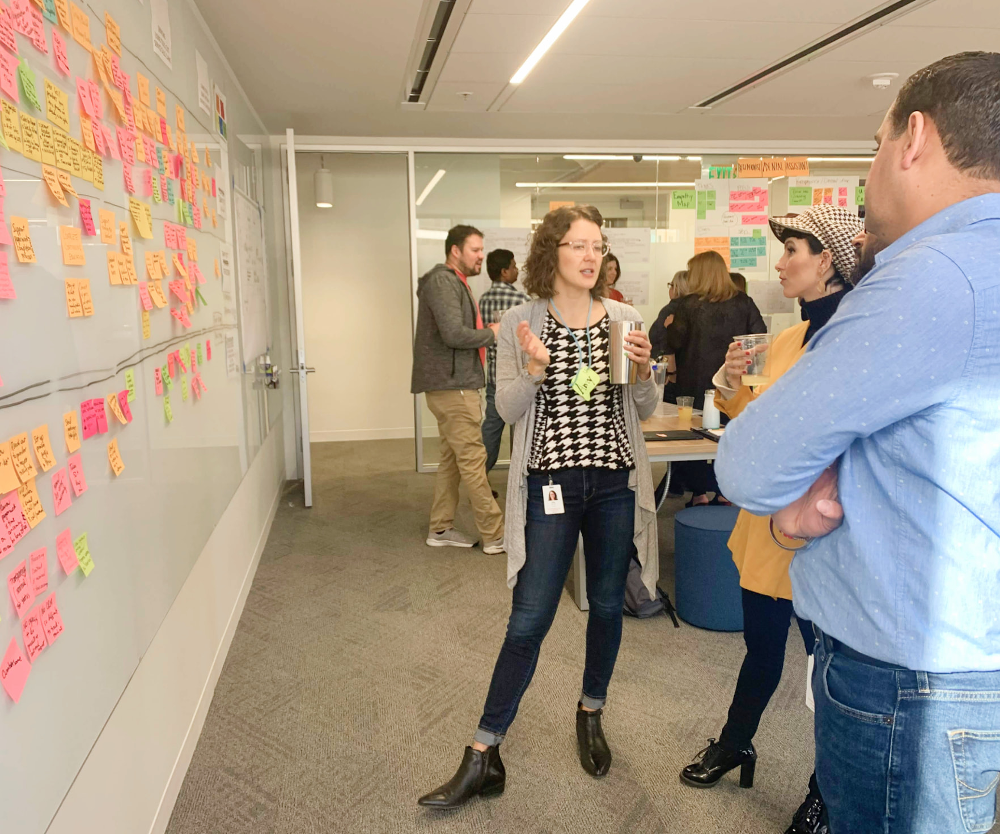
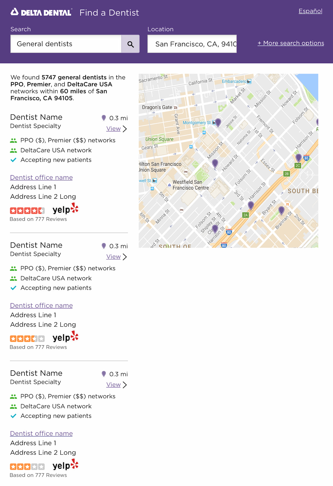
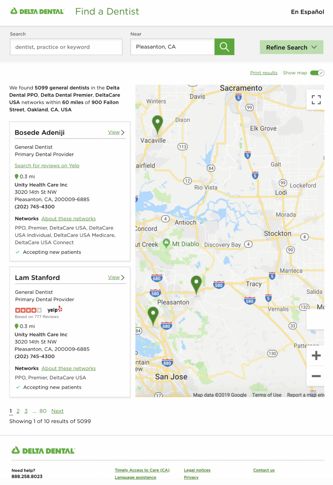
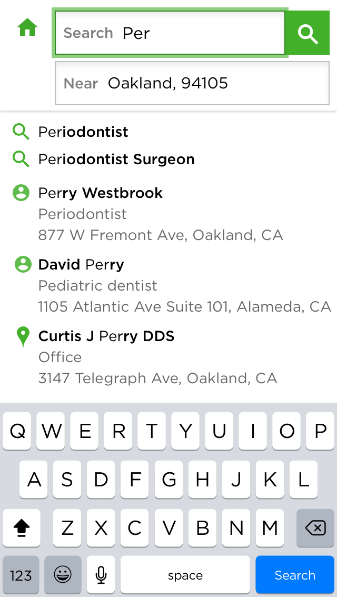

# Provider Search @ Delta Dental

One of my favorite projects while working at Delta Dental (as UX designer) was the redesign of the Delta Dental Provider Search website. Provider Search is an online tool that helps members find dentists who participate in the Delta Dental network. 

In this project, I collaborated with user research, created storyboards, wireframes, prototypes, performed usability tests, interacted on workshops to enhance the member journey map, and conducted accessibility reviews along with engineers. 

**My team:**
   - Product Designer: 1 (me) 
   - Engineers: 2
   - QA: 1 
   - Product Manager: 1
   - Project Manager and Scrum Master: 1
   - Dedicated UX Researcher: 1 
   - Business Analyst: 1

## The problem 

The tool was causing challenges for users trying to find providers due to inadequate filter options, a small map canvas that lacked interactive navigation feature, plus lack of responsive behavior for mobile members. Additionally, the website was undergoing a rebranding, which required the creation of a new color scheme to align with the updated brand specifications. 

## User Research 

I was fortunate enough to have a talented UX Research partner who helped me to draft studies, user interviews, and usability tests to validate my design proposals. 

The interviews and usability tests were based on four main personas: the member, the office manager, the provider, and the receptionist. Those are the people who interact with the Provider Search tool by searching for a dentist or uploading information to the catalog. 

Persona example for reference: 

 

 

**Main findings:**

   - 66% of participants didn’t like the usability of the current tool 
   - 72% of participants desired the ability to manipulate location (by map interaction) when searching for a dentist 
   - 54% of participants found the website aesthetic a bit outdated 
   - While most of the members use the tool on the web, there was a desire for a better experience for mobile screens. 

One of the things I enjoyed while working at Delta Dental was the workshops we used to run to refine our journey map. Teams would get together to discuss research findings, and collaborate on how to enhance the member and provider experience. 

 

<small>Journey map workshop at Delta Dental</small>

 

## The design solution 

The goal was to enhance search functionality by providing multiple filtering options and enabling map-based searches, which reduced usability and accessibility issues while increasing overall access.

**My proposals: (that shipped 🎉)**

   - Cleaner user interface: Increase white space and reorganize low-emphasis information to reduce content overload and prevent heavy cognitive load.
   - Map interaction: Ability to show and hide the map and refine search by location. The map was interactive and the location pins connected to the cards list. 
   - Filter by criteria: Refine search by factors such as specialty (e.g., orthodontist, periodontist), languages spoken, and patient age.  
   - View provider information: Get details about each dentist, such as their contact information, office hours, and patient reviews.  
   - Ability to compare providers: Easily compare different dentists in your area based on factors like location, services offered, and patient reviews.

## UI redesign   

### Provider Search directory (before) 

 

 

### Provider Search directory (after)

 

 

### Mobile search autosuggest enhancement 

 

 

*Due to privacy concerns, I can’t share more information or design work. Feel free to reach out to me for more context if you would like to learn more. You can also visit the [Delta Dental website](https://www.deltadental.com/us/en/member/find-a-dentist.html) and look for the "Find a Dentist" or "Provider Search" link to interact and learn more about the Provider Search tool.  

## Learnings 

I gained valuable insights by engaging with various stakeholders and user research, and the experience I redesigned received positive feedback from our users. However, there is still much work to be done concerning accessibility improvements. The Delta Dental color palette heavily relies on different shades of green, which could pose challenges for color-blind users. My next step would be to experiment with the UI elements and the color palette to enhance visibility and improve user interactions regarding the map feature.

 

💙 <ins>Kudos from an engineer:</ins>

> "I appreciate your can-do spirit and joyful attitude during this quarter. It was a challenging project, but the  Provider Search is now a better tool for our users. It was such a blast collaborating with you through the redesign process. I can’t wait for the next iteration."

 